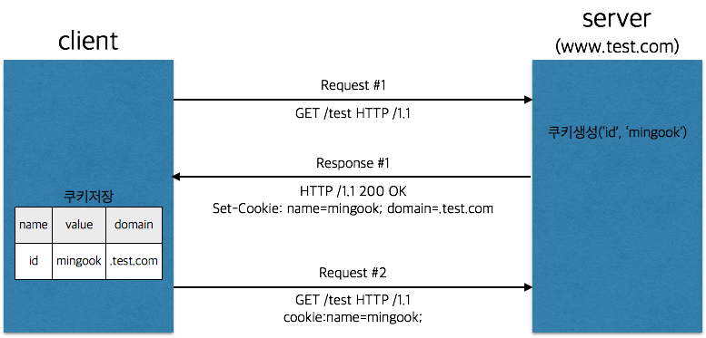
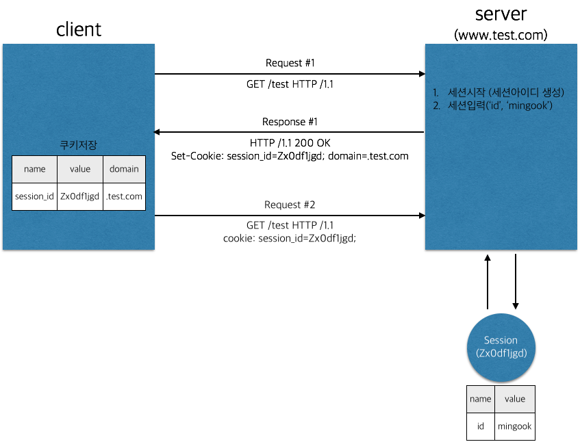

# Sessions and Cookies
## HTTP 특징
### Connectionless and Stateless.
HTTP는 요청과 응답을 주고받는 순간에만 잠깐 연결되고 끊어진다. 그렇기 때문에 서버와 클라이언트는 현재의 Request에서만 서로를 인지할 수 있다. 이런 HTTP의 특성으로 클라이언트와 서버는 서로 다른 요청간에 정보를 공유할 수 없게된다.

서버가 클라이언트의 상태를 유지할 필요가 있을 경우(예를 들어 로그인상태라던지), 서버는 이런 상태를 쿠키와 세션을 이용해 저장한다.

## Cookie
쿠키와 세션은 서버에서 클라이언트의 상태를 유지하는 수단으로, 둘이 다른 점은 쿠키는 항상 클라이언트에 데이터를 저장한다는 점이다.

### 쿠키 작동 원리

1. Request #1 을 보면, 헤더에는 쿠키에 관련된 값이 없다.
2. 서버에서는 응답을 볼내기 전, 쿠키에 ‘id’ 라는 키로 ‘mingook’ 이라는 값을 설정했다.
3. Response #1 에는 Set-Cookie 라는 헤더에 설정한 쿠키값이 담겨서 클라이언트로 내려간다. 이때 ‘domain’이라는 값이 생겼다. (config로 설정하기도, 직접 입력하기도 한다.)
4. 클라이언트에서는 Set-Cookie 헤더의 값을 표와 같이 저장한다.
5. 다시 요청을 보낼때, 클라이언트는 쿠키의 domain을 확인하고 해당 domain으로 요청을 보낼경우 cookie 헤더에 값을 설정하여 요청을 보낸다.

**!!!** 쿠키는 클라이언트에 저장되기 때문에 보안에 취약하다

## Session
세션은 쿠키에 저장되기도, 클라이언트에 저장되기도 한다. 

### 세션 저장 방법

#### Server-side
- 메모리
- 파일
- 데이터베이스

#### Client-side
- 쿠키

만약, 부하분산을 위해 한 도메인에 여러대의 서버를 운영하고 있다면, 데이터베이스나 쿠키를 이용해야 한다. 메모리나 파일은 물리적으로 서버간에 나누어져 있기 때문에, 세션이 유지될 수 없다.

### 세션 작동 원리

1. Request #1 요청이 들어왔다.
2. 서버에서는 세션을 시작하고, 세션에 ‘id’ = ‘mingook’ 이라는 값을 설정했다.
3. Response #1 에서의 Set-Cookie헤더를 잘 보자. 쿠키때와는 다르게 이번에는 session_id가 내려간다. (세션아이디의 key는 컨테이너마다 다를 수 있다.)
4. 이제 클라이언트에서는 .test.com 도메인으로의 요청에는 session_id를 쿠키에 담아 전송한다.
5. 서버에서는 session_id를 가지고 해당 클라이언트의 세션을 찾아서 필요한 값을 조회한다. 즉, session_id는 서버가 클라이언트를 구분할 수 있게 해주는 key가 된다.

## Reference
- [쿠키와 세션에 대해 알아보자](https://cinabrosite.wordpress.com/2017/01/24/cookie_session/)